# Calculette
Calculette LOGISIM

1ERE ETAPE : LE DEMI ADDITIONEUR :

Conception d’un demi additionneur puis d’un additionneur :
On a déduit la conception du demi-additionneur et de l’additionneur grâce aux opérations booléennes de base, en commençant sur 1 bit. 
Par exemple 1 + 1 on doit renvoyer 0 et mettre une retenue, 1 + 0 on revoit 1 sans retenue etc…

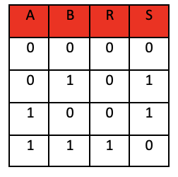
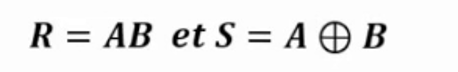
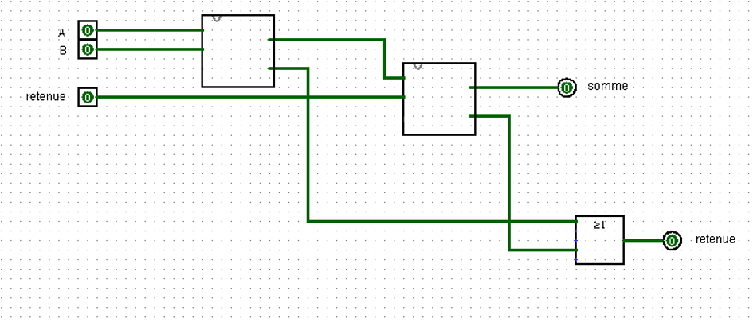
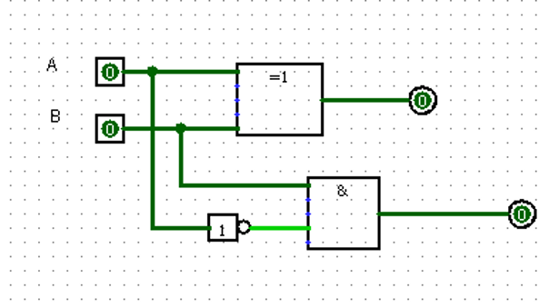
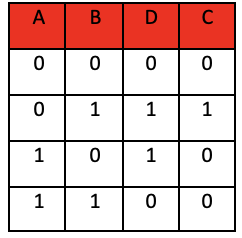
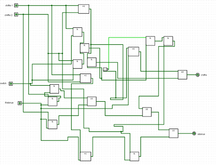
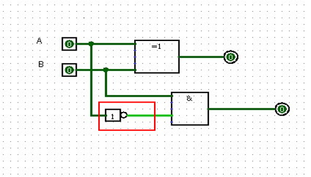
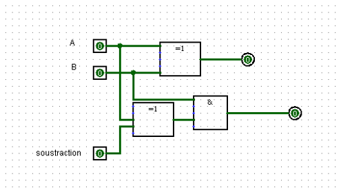
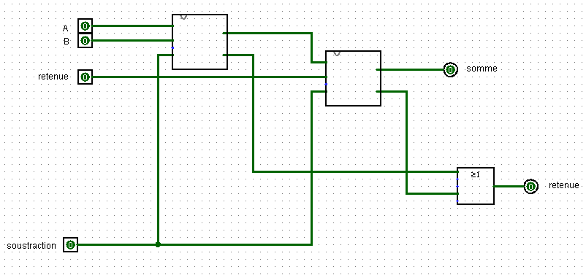
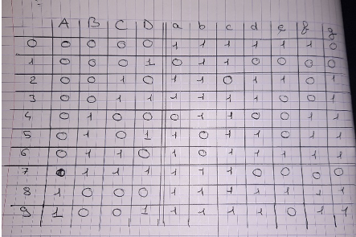
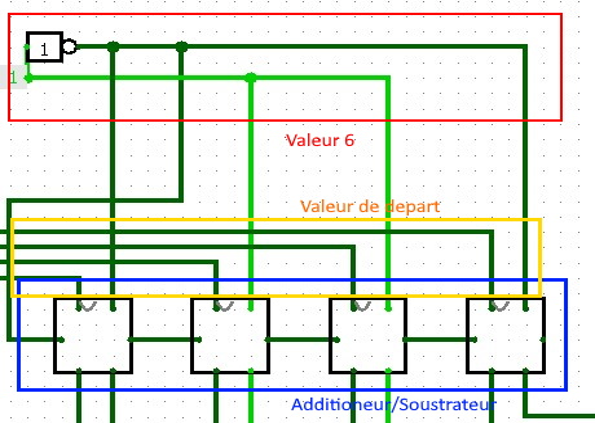
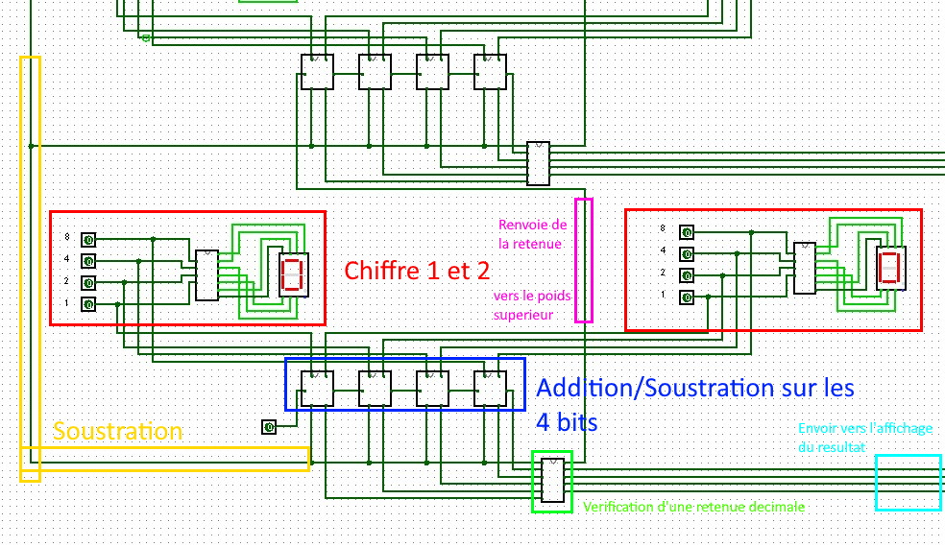

